# EasyReads Database Diagram (Mermaid)

```mermaid
erDiagram
    BOOKS {
        ObjectId _id PK
        string name
        string ISBN UK
        string author
        string image_link
        string amazon_link
        date createdAt
        date updatedAt
    }
    
    EBOOKS {
        ObjectId _id PK
        string name
        string ISBN UK
        string author
        string image_link
        string amazon_link
        date createdAt
        date updatedAt
    }
    
    AUDIOBOOKS {
        ObjectId _id PK
        string name
        string ISBN UK
        string author
        string narrator
        string image_link
        string amazon_link
        date createdAt
        date updatedAt
    }
    
    FICTIONBOOKS {
        ObjectId _id PK
        string name
        string ISBN UK
        string author
        string image_link
        date createdAt
        date updatedAt
    }
    
    SCIENCEBOOKS {
        ObjectId _id PK
        string name
        string ISBN UK
        string author
        string image_link
        date createdAt
        date updatedAt
    }
    
    BIOGRAPHYBOOKS {
        ObjectId _id PK
        string name
        string ISBN UK
        string author
        string image_link
        date createdAt
        date updatedAt
    }
    
    FANTASYBOOKS {
        ObjectId _id PK
        string name
        string ISBN UK
        string author
        string image_link
        date createdAt
        date updatedAt
    }
    
    HISTORYBOOKS {
        ObjectId _id PK
        string name
        string ISBN UK
        string author
        string image_link
        date createdAt
        date updatedAt
    }
    
    TECHNOLOGYBOOKS {
        ObjectId _id PK
        string name
        string ISBN UK
        string author
        string image_link
        date createdAt
        date updatedAt
    }
    
    ROMANCEBOOKS {
        ObjectId _id PK
        string name
        string ISBN UK
        string author
        string image_link
        date createdAt
        date updatedAt
    }
    
    USERS {
        ObjectId _id PK
        string username UK
        string password
        date createdAt
        date updatedAt
    }
```

## Collection Descriptions

### books
- **Purpose**: General books collection
- **Key Fields**: ISBN (unique), name, author, image_link, amazon_link
- **Indexes**: ISBN (unique)

### ebooks
- **Purpose**: E-books collection
- **Key Fields**: ISBN (unique), name, author, image_link
- **Optional**: amazon_link
- **Indexes**: ISBN (unique)

### audiobooks
- **Purpose**: Audiobooks collection
- **Key Fields**: ISBN (unique), name, author, narrator, image_link
- **Optional**: amazon_link
- **Indexes**: ISBN (unique)

### Category Books (fictionbooks, sciencebooks, biographybooks, fantasybooks, historybooks, technologybooks, romancebooks)
- **Purpose**: Category-specific book collections
- **Key Fields**: ISBN (unique), name, author, image_link
- **Indexes**: ISBN (unique) on each collection

### users
- **Purpose**: User accounts (optional, primary auth via Firebase)
- **Key Fields**: username (unique), password (hashed)
- **Indexes**: username (unique)

